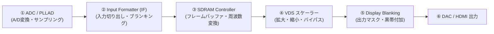
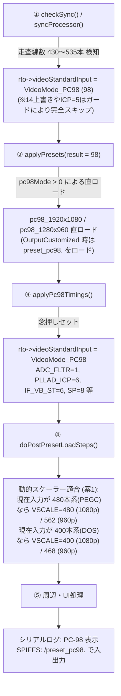

# GBS-Control / TV5725 技術仕様・レジスタ・挙動知見集 (GBS.md)

本ドキュメントは、**GBS-Control およびビデオプロセッサ TV5725** に対する各種レジスタ操作、シリアルコマンド、内部パイプラインの挙動、ハードウェア制約、および実験によって判明した知見の記録です。

※ PC-98 実機のタイミング仕様や実機検証ログは **[`PC98.md`](PC98.md)**、AI エージェントの運用ルールは **[`AGENTS.md`](../AGENTS.md)** を参照してください。

---

## 1. TV5725 内部パイプラインと各ブロックの役割



### 1.1 各ブロックの役割と特徴

| ブロック | 役割 | 主なレジスタ | 挙動の特徴と注意点 |
| :--- | :--- | :--- | :--- |
| **① ADC / PLLAD** | アナログ波形の標本化（デジタル画素化） | `PLLAD_MD`, `PLLAD_KS`, `PLLAD_ICP`, `ADC_FLTR` | ・1ラインあたりのサンプリング総ドット数を決定。<br>・変更時は `latchPLLAD()` と `updateClampPosition()` が必須。 |
| **② Input Formatter (IF)** | サンプリング波形からアクティブ映像を切り出し | `IF_HB_ST2`, `IF_HB_SP2`, `IF_VB_ST`, `IF_VB_SP`, `IF_HS_DEC_FACTOR` | ・`IF_VB_*` は「ブランキングパルス幅（数ライン）」であり、キャプチャ範囲ではない。<br>・`IF_HB_ST2` が安全リミット（`IF_HSYNC_RST - 0x30`）を超えると `0` にリセットされる。 |
| **③ SDRAM Controller** | フレームバッファへの格納とレート非同期変換 | `PB_DB_BUFFER_EN`, `PLL_MS` (SDRAM Clock) | ・マルチバッファリングにより、入力（70Hz/56.4Hz等）と出力（60.00Hz）のフレーム周波数変換を実現。<br>・入力ピクセル数より出力枠が広いと、未初期化領域のカラフルなゴミデータが露出する。 |
| **④ VDS (スケーラー)** | デジタル画素の拡大・縮小 | `VDS_VSCALE`, `VDS_HSCALE`, `VDS_HSCALE_BYPS` | ・1080p（148.5MHz）ではスケーラー演算速度限界（約110MHz）を超えるため、`VDS_HSCALE_BYPS = 1`（バイパス）が必須。<br>・スケーラー稼働時、縮小した余白に同じ映像を延々とリピート描画する（テクスチャリピート仕様）。 |
| **⑤ Display Blanking** | 出力画面上の非表示（黒帯）マスク | `VDS_DIS_HB_ST`, `VDS_DIS_HB_SP`, `VDS_DIS_VB_ST`, `VDS_DIS_VB_SP` | ・「表示領域」ではなく「非表示（マスク）の開始・終了」を指定する。<br>・1080p ではこれを用いて左右各 240px をマスクし、1440px ピラーボックスを形成している。 |

---

## 2. 重要レジスタの詳細仕様・挙動・落とし穴 (Gotchas)

### 2.1 Input Formatter (IF)

1. **`IF_VB_ST` / `IF_VB_SP` (垂直ブランキング)**:
   - **仕様**: 垂直同期パルス（非表示期間）の幅を指定する。
   - **落とし穴**: 有効映像ライン数（400本など）を指定すると、400本が丸ごと黒くマスクされ、最下行ファンクションバーが上に回り込み、画面の大部分が緑帯になる。
   - **正しい設定**: `IF_VB_ST: 6`, `IF_VB_SP: 8` などの数ライン幅のパルス幅を指定する。

2. **`IF_HS_DEC_FACTOR` (水平デシメーション・間引き)**:
   - **仕様**: 水平画素の間引き係数（`0`: 間引きなし 1x, `1`: 1ドットおき間引き 2x）。
   - **落とし穴**: `1` にすると、青色信号などの特定ドットが間引かれて隣の画素と干渉し、「青背景に紫と黒の細かい縦縞」が発生する。
   - **正しい設定**: 必ず `0`（間引きなし）にする。

3. **`IF_HB_ST2` / `IF_HB_SP2` (水平キャプチャ位置と目盛り・ピクセル換算)**:
   - **仕様**: 水平ブランキング開始・終了位置（アクティブ映像の切り出し範囲）。
   - **目盛りと実際のデータ数の関係**:
     - IF の目盛りは ADC の 2分周（40.25MHz）でカウントされる。
     - したがって、**1 目盛りの間に実際は「2個のピクセル（ADCサンプル）」が通過している**。
     - 切り出し幅 `1020 目盛り` の中には、実際には **2040 サンプル（画素）もの超高密度データ** が含まれており、1080p の 1440px 枠を満たすのにデータ不足は一切起きない。
     - **換算比率**: 1080p 出力時、`1 IF 目盛り ≒ 約 1.412 画面ピクセル`。シリアル `'7'`/`'6'` の 4 目盛り移動は画面上で約 5.6 ピクセルのシフトに相当する。
   - **動的書き換え時の落とし穴（高速スクロールバグ）**: 映像出力中にシリアル等で `IF_HB_SP2` / `IF_HB_ST2` レジスタを単発で直接書き換えると、SDRAM コントローラの書き込みアドレスカウンタが非同期にリセットされて同期が破綻し、「画面が斜めに高速スクロールするバグ」が発生する。初期化シーケンス（`applyPc98Timings`）を通じて適用する必要がある。
   - **安全リミットの落とし穴**: `IF_HB_ST2` に `(IF_HSYNC_RST - 0x30)` 以上の値を設定すると、ファームウェアの境界チェックで強制的に `0` にリセットされ、画面右側 1/3 が切り落とされてゴミデータになる。

### 2.2 ADC / PLLAD

1. **`PLLAD_MD` (ADC サンプリングレート / 分周比)**:
   - **仕様**: 1ラインあたりの ADC サンプリング総クロック数を決定。
   - **挙動**: 31kHz（fH: 31.47kHz）において `PLLAD_MD = 2558`（サンプリング周波数 80.5MHz）で動作。アクティブ映像期間（約 25.4μs）で 2046 サンプル（1020 目盛り分）を取得する。
   - **注意点**: 変更時は `IF_HSYNC_RST`（`PLLAD_MD / 2`）の更新、`latchPLLAD()`、`updateClampPosition()` をアトミックに実行する必要がある（シリアルの 1 バイト操作では PLL がロックせず abort する）。

### 2.3 VDS (スケーラー) & Display Blanking

1. **`VDS_HSCALE_BYPS` (水平スケーラーバイパス)**:
   - **仕様**: `1` で水平スケーラーをバイパス（SDRAM から 1:1 出力）。
   - **1080p の必須制約**: 1080p 出力（148.5MHz）時は、チップの演算速度限界により必ず `1`（バイパス）にすること。解除すると文字の上に激しい砂嵐ジッターが発生する。

2. **`VDS_VSCALE` (垂直スケーラー倍率)**:
   - **仕様**: 垂直倍率（値が小さいほど画面拡大、大きいほど縮小）。
   - **1080p**: `400`（等倍・縦 1080px 全画面フィット、下端ノイズ 0px）。
   - **720p**: `612`（垂直ジャストフィット）。
   - **落とし穴**: 1080p で 16:10（縦 900px）にしようと `480` に縮小すると、900 本目以降に SDRAM の未初期化ゴミ領域が露出する。

3. **Display Blanking（左右マスク）の絶対的ハードウェア限界 (1356 / 348)**:
   - **役割**: Input Formatter が SDRAM に書き込んだ有効領域（1440px）の外側にある「未初期化ゴミデータ」を黒帯で覆い隠すフタ。
   - **左側マスク（`VDS_DIS_HB_SP`）を 348 より左（328等）に広げた場合**:
     - SDRAM の前ラインの末尾データ（右端のデータ）が、次のラインの左端の前に回り込んでゴミとして表示される（**SDRAM 水平ラップアラウンド現象**）。`348` が SDRAM の絶対先頭境界線。
   - **右側マスク（`VDS_DIS_HB_ST`）を 1356 より右（1376等）に広げた場合**:
     - 1080p（148.5MHz）の出力ピクセルレートに対して TV5725 のスケーラーバイパス FIFO がアンダーランを起こし、**末尾 6px が 1px おきにサンプリング落ち（歯抜け描画）し、走査線ジッターノイズが発生** する。
   - **結論**: 1080p 出力時の Display Blanking（`1356 / 348`、幅 1440px）は、1 ドットも拡張できない **TV5725 の絶対的なハードウェア境界線** である。

4. **スケーラーのテクスチャリピート仕様**:
   - 720p などスケーラーが稼働する解像度において、縮小して余ったスペースがあると、TV5725 は次のラインまで同じ映像を繰り返し描画するハードウェア仕様を持つ。

5. **`scaleHorizontal`（シリアル操作等）の内部副作用の罠**:
   - GBS-Control の `scaleHorizontal()` 関数は、`VDS_HSCALE`（スケーラー倍率）を変更するだけでなく、内部で自動的に `shiftHorizontal()`（フェッチ窓の左シフト）を実行する。
   - そのため、コマンドで水平スケーラーを操作すると意図せずフェッチ窓が SDRAM 境界を越えて移動し、左端に赤帯や未初期化領域のノイズが誘発される。
   - 横幅のみを純粋に微調整したい場合は、フェッチ窓を動かさず `VDS_HSCALE`（Reg `3_16` / `3_17`）のみを直接書き換える必要がある。

6. **162MHz 超高速駆動時におけるスケーラーの右端アンダーラン**:
   - TV5725 のスケーラー演算回路は元来 100〜110MHz 前後を想定して設計されている。
   - 960p 駆動のために 162MHz（`0xA5`）の超高速ピクセルクロックを与えた状態でスケーラーを稼働させると（`VDS_HSCALE_BYPS = 0`）、各走査線の最右端（ライン終了付近）で演算回路の供給がピクセル出力速度に追いつかず、**「右端の数ドットにドット状のランダムノイズが発生する現象（FIFOアンダーラン）」** が発生する。
   - スケーラーを完全にバイパスする 1080p（`VDS_HSCALE_BYPS = 1`）ではこのアンダーランは発生しない。960p でスケーラーを使用する場合は、右端数ドットのノイズはハードウェア速度限界に伴う許容トレードオフとなる。

### 2.5 出力ピクセルクロック (PLL648) & 垂直ブランキング (VDS_DIS_VB) のハードウェア制約

1. **`PLL648_CONTROL_01` (Seg 0x00, Offset 0x41) 出力ピクセルクロック対応表**:
   - `0x25`: 40.5 MHz
   - `0x45`: 54.0 MHz
   - `0x55`: 64.8 MHz
   - `0x65`: 81.0 MHz
   - **`0x85`**: **108.0 MHz**
     - **【VESA 標準ピクセルクロック】**: VESA 1280x960 @ 60Hz（HTotal 1800, VTotal 1000）の業界標準クロック。1080p（1601 x 1125）でも常用されている。
     - ※ 過去のコード注記にある `around 108MHz the library seems to double the clock` は、外付けクロックジェネレータ **Si5351 の Arduino ライブラリ内部の分周比バグ**（`Si.setFreq` の問題）に対するワークアラウンドであり、**TV5725 内部 PLL のハードウェアバグではない**。標準基板の内部水晶発振では 108.0MHz は極めて安定して発振する。
   - `0x95`: 129.6 MHz
   - **`0xA5`**: **162.0 MHz**
     - **【GBS-Control 240p プリセットの動作仕様】**: 240p（15kHz）4倍拡大用プリセットで採用されているクロック。HTotal を **2704** に設定して `162,000,000 / (2704 * 1000) = 59.91 Hz`（NTSC 60Hz）を生成する。
     - **【注意・スケーラー速度限界】**: 162MHz は TV5725 のスケーラー定格（〜110MHz）を超えるため、スケーラー稼働時にライン末尾で FIFO アンダーラン（右端数ドットのノイズ）が発生する。
   - `0x75`: 外部クロックジェネレータ（Si5351 Mod）使用時

2. **`PLL_CKIS` (Seg 0x00, Offset 0x40, bit 0) - クロックソース切替**:
   - `0`: 内部オシレータ（水晶発振器）を使用（標準 GBS-8200 基板）。
   - `1`: 外部クロック（ICLK端子）を使用。
   - **【罠・注意】**: 外部クロック Mod を施していない標準基板で `PLL_CKIS = 1` を書き込むと、クロック入力が途絶えて DAC が即座にブラックアウト（完全無信号）に陥る。シリアルコマンド `'C'` は内部で `PLL_CKIS = 1` を実行するため標準機では送信禁止。

3. **`VDS_DIS_VB_ST` (Seg 0x03, Offset 0x13) - 垂直ブランキングと VTotal の整合性**:
   - 出力垂直ブランキングの開始/待機カウンタ。
   - **【絶対制約】**: 必ず出力解像度の `VTotal`（`VDS_VSYNC_RST`）以下の値に設定しなければならない（例: 960p では VTotal=1000 に対して `1000 / 38`）。
   - **スクロール・回転のメカニズム**: 1080p の初期値（`1125 / 40`）が残ったまま VTotal=1000 の信号を出力すると、1000 本しかない画面で 1125 本目までブランキングを待とうとしてカウンタがオーバーフローし、毎フレーム垂直同期位相がズレて画面が縦方向に流れる（回転する）。

---

### 2.6 同期プロセッサ (SP) と入力同期モード (RGBHV vs SOG)

1. **`SP_SOG_MODE` (Seg 0x05, Offset 0x56, bit 0) - SOG vs ノーマルRGBHV**:
   - `0`: ノーマルモード（HSync ピンおよび VSync ピンからセパレート同期を取得）。PC-98（RGBHV）は必須。
   - `1`: SOG（Sync-on-Green）モード（G 信号コンパレータ出力から同期を取得）。
   - **【落とし穴・垂直高速スクロールバグの完全解明】**:
     PC-98 はセパレート同期（RGBHV）のため、垂直同期は VSync ピン（TTL）から入力される。
     しかし、プリセットの動的切替時などに `SP_SOG_MODE = 1`（SOGモード）になっていると、SP は VSync ピン入力を無視して G 信号から垂直同期を探そうとする。
     PC-98 の G 信号には複合同期信号が重畳されていないため、垂直同期を完全に見失い、内部ステータス **`vt`（検出垂直ライン数）が `0`** になる。その結果、テレビ・モニタ側で垂直同期が外れ、**「文字は見えているのに画面が垂直方向に高速スクロール（ロール）する現象」** が発生する。
   - **解決策**: `SP_SOG_MODE = 0`（`s5s56s00`）を書き込むことで、即座に VSync ピンが認識されて `vt: 448`（PC-98 本来の垂直総ライン数）がカウントされ、高速スクロールがピタッと止まる。

---

## 3. シリアルデバッグコマンドリファレンス

| コマンド | 機能 | 動作詳細・出力 | 注意点 |
| :---: | :--- | :--- | :--- |
| **`,`** | **ビデオタイミング情報出力** | `HT/scale`, `HB ST/SP(d)`, `VT/scale`, `VB ST/SP(d)`, `IF VB ST/SP`, `CsVT` を表示 | 実機設定の確認に最適 |
| **`!`** | **同期周波数・PLL確認** | `sfr` (入力fV), `pll` (PLLAD_MD) を表示 | 同期検知の確認 |
| **`D`** | **デバッグビュー切替** | 同期プロセッサの詳細ログ（毎秒出力）をトグル | |
| **`4`** | **垂直スケーラー拡大** | `scaleVertical(2, true)`: `VDS_VSCALE` を 2 減少 | 縦に引き伸ばす |
| **`5`** | **垂直スケーラー縮小** | `scaleVertical(2, false)`: `VDS_VSCALE` を 2 増加 | 縦を縮める |
| **`6`** | **水平キャプチャ左移動** | `IF_HB_ST2 -= 4`, `IF_HB_SP2 -= 4` | 映像を右へシフト |
| **`7`** | **水平キャプチャ右移動** | `IF_HB_ST2 += 4`, `IF_HB_SP2 += 4` | 映像を左へシフト |
| **`0` / `1`** | **水平シフト (moveHS)** | 出力側の水平表示位置を左右に移動 | |
| **`9`** | **PC-98 31kHz トグル** | PC-98 31kHz モード（70Hz → 60Hz）の ON/OFF | |
| **`8`** | **PC-98 24kHz トグル** | PC-98 24kHz モード（56.4Hz → 60Hz）の ON/OFF | |
| **`s`** | **1080p プリセット切替** | 出力 1920x1080 @ 60Hz | 復帰用推奨 |
| **`g`** | **720p プリセット切替** | 出力 1280x720 @ 60Hz | |
| **`p`** | **1280x1024 プリセット切替**| 出力 1280x1024 (SXGA) @ 60Hz | |
| **`f`** | **960p プリセット切替** | 出力 1280x960 @ 60Hz | |
| **`h`** | **480p プリセット切替** | 出力 720x480 / 640x480 @ 60Hz | |
| **`(`** | **1080p 強制ロード** | NTSC 1080p 復帰 | 同期崩壊時の復帰用 |
| **`E`** | **1280x1024 強制ロード** | NTSC 1280x1024 復帰 | 同期崩壊時の復帰用 |
| **`Y`** | **720p 強制ロード** | NTSC 720p 復帰 | 同期崩壊時の復帰用 |
| **`r` / `R`**| **【絶対禁止】PAL強制ロード** | **PAL 50Hz（240p / 1024p）が強制出力され、同期が崩壊する** | **絶対に送信禁止** |

---

## 4. ファームウェア書き換え（Upload）プロトコル

1. **実行コマンド（固定）**:
   - **ビルド確認（コンパイルのみ）**:
     ```powershell
     & "$env:USERPROFILE\.platformio\penv\Scripts\platformio.exe" run
     ```
     ※ `-e` などの環境オプションは付けない（承認ダイアログが変わるため）。
   - **ファームウェア書き込み（Upload）**:
     ```powershell
     & "$env:USERPROFILE\.platformio\penv\Scripts\platformio.exe" run -t upload
     ```
2. **事前のモード切り替え依頼**:
   - GBS（ESP8266）へのファームウェア書き込みには、GBS 本体を「ファームウェア書き換えモード」で再起動する必要がある。
   - 勝手な Upload 実行は失敗や意図しない動作の原因となるため、**必ず事前にユーザーへモード切り替えを依頼し、合図（OK）を受け取ってから実行する**。
3. **書き換え後のコールドブート**:
   - 書き込み完了後は TV5725 チップを通常起動シーケンスで初期化するため、**必ず GBS 本体の電源プラグ抜き差し（コールドブート）を案内する**。

---

## 5. videoStandardInput の内部仕様と PC-98 モード実行時の影響トレース

### 5.1 videoStandardInput の規格 ID 一覧

| ID | 定義規格 / 信号 | GBS-Control 内での主な役割・挙動 |
| :---: | :--- | :--- |
| **`0`** | `Unknown` | 未検出・リセット初期状態 |
| **`1`** | `NTSC 15kHz` (240p/480i) | 15kHz SD処理。インターレース解除、コーミング除去、フレームタイムロック等 |
| **`2`** | `PAL 15kHz` (288p/576i) | 50Hz SD処理 |
| **`3`** | `EDTV 480p` (NTSC 31kHz) | 31kHz プログレッシブ。480p/720p への特殊マッピング |
| **`4`** | `EDTV 576p` (PAL 31kHz) | 50Hz プログレッシブ |
| **`5`** | `HDTV 720p` | ハイビジョンバイパス対象 |
| **`6`** | `HDTV 1080i` | ハイビジョンバイパス対象 |
| **`7`** | `HDTV 1080p` | ハイビジョンバイパス対象 |
| **`8`** | `Medium Res` (24kHz) | アーケード 24kHz 向け（PC-98 は 98 へ完全分離） |
| **`9`** | *(未使用・予約)* | コード内で定義・参照はあるが処理は空っぽ |
| **`13`** | `PS2 Graphic RGB` | PS2 のコンポーネント/RGB 検出 |
| **`14`** | `VGA (scaling RGBHV)` | DOS/V 用 VGA。`needPostAdjust`、`PLLAD_ICP=5` などの副作用多数 |
| **`15`** | `RGBHV Bypass` | スケーラー（VDS）完全バイパス（パススルー出力） |
| **`98`** | **`PC-98` (`VideoMode_PC98`)** | **PC-98 専用統合規格 ID。24kHz/31kHz/PEGC 480p を一元管理** |

---

### 5.2 PC-98 モード動作時におけるメソッド呼び出しフローと影響トレース

PC-98 モード（`uopt->pc98Mode > 0`）動作時は、二重管理だった `isPc98Active` フラグを廃止し、**`videoStandardInput = VideoMode_PC98 (98)` に完全一本化** されました。



#### 各メソッドでの詳細な挙動と実装内容
1. **入力検知フェーズ (`checkSync()`, `syncProcessor()`, `getVideoMode()`)**:
   - `getVideoMode()`: `uopt->pc98Mode > 0` のときは、HSync がアクティブ (`STATUS_SYNC_PROC_HSACT == 1`) である限り問答無用で `VideoMode_PC98 (98)` を返す（無信号時のみ `0`）。走査線数で縛らないため、ハイレゾや高解像度への変化でも誤ロストしない。
   - `checkSync()`: `uopt->pc98Mode > 0` かつ RGBHV 入力時に直ちに `rto->videoStandardInput = VideoMode_PC98;` をセット。
   - **【レガシー相乗りの完全解消】**: `checkSync()` および `syncProcessor()` の `rto->videoStandardInput = 14;`、`PLLAD_ICP = 5` 引き下げ、および `needPostAdjust` は PC-98 では 100% スキップされる。
   - **【動的解像度切り替え】**: `checkSync()` 内の PC-98 専用ブロックで、400本系 ⇔ 480本系 PEGC の遷移を検知した際、全リセット（`applyPresets`）を走らせず、**`VDS_VSCALE` のみ即座に切り替えて瞬時に追従** する。
2. **プリセット適用フェーズ (`applyPresets(byte result)`)**:
   - `result == VideoMode_PC98` または `rto->videoStandardInput == VideoMode_PC98` のとき、PC-98 専用プリセット（1080p: `pc98_1920x1080`、960p: `pc98_1280x960`、480p: `ntsc_720x480`）が適用される。
   - カスタムスロット指定時（`OutputCustomized`）は `loadPresetFromSPIFFS(98)` から `/preset_pc98.<slot>` を読み出す。
3. **PC-98 タイミング適用フェーズ (`applyPc98Timings()`)**:
   - `rto->videoStandardInput = VideoMode_PC98;` をセット。
   - `PLLAD_ICP = 6`, `ADC_FLTR = 1`, `IF_VB_ST = 6`, `IF_VB_SP = 8`, `setOverSampleRatio(2, true)` 等を適用。
4. **プリセット後処理フェーズ (`doPostPresetLoadSteps()`)**:
   - `rto->videoStandardInput == VideoMode_PC98` 専用の独立分岐を新設（アーケード `8` や汎用 VGA `14` の相乗りを完全撤廃）。
   - **【動的スケーラー適合と GA / 高解像度保護】**:
     - スロット読込時やプリセット適用時、現在の総走査線数 `sourceLines` をチェック：
       - **480本系 (`470 < sourceLines <= 560`) - PEGC / Windows VGA (vt ≒ 525)**:
         - 1080p: `GBS::VDS_VSCALE::write(480);`
         - 960p: `GBS::VDS_VSCALE::write(562);`
       - **400本系 (`sourceLines <= 470`) - DOS / BIOS (24kHz vt ≒ 439 / 31kHz vt ≒ 449)**:
         - 1080p: `GBS::VDS_VSCALE::write(400);`
         - 960p: `GBS::VDS_VSCALE::write(468);`
       - **高解像度系 (`sourceLines > 560`) - GA (800x600 SVGA vt: 625..666) / ハイレゾ (vt: ~800)**:
         - 480p 用スケーラーの誤適用を防止し、ベースプリセット値を保護。
5. **周辺・UI処理**:
   - **シリアル表示 (`printInfo()`)**: `videoStandardInput == VideoMode_PC98` で `"PC-98 "` を出力。
   - **SPIFFS 保存・読込 (`savePresetToSPIFFS`, `loadPresetFromSPIFFS`)**: `/preset_pc98.<slot>` を使用。ファイル不在時は `pc98_1920x1080` に安全フォールバック。

---

### 5.3 H-PLL ゲイン (`PLLAD_FS`) と水平キャプチャ位相（見切れ・ビート）の物理メカニズム

実機検証（24k ⇔ 31k ⇔ PEGC 480p 相互切り替え）により判明した、TV5725 の H-PLL ゲインと水平・垂直同期の決定的な挙動知見：

| モード | 走査線数 | 水平周波数 | `pllRate` | `PLLAD_FS` | `VSCALE` (1080p) | 水平位置 (`IF_HB_ST2`) |
| :--- | :---: | :---: | :---: | :---: | :---: | :---: |
| **24k DOS (400p)** | ~439本 | 24.83 kHz | 1644 | **`0` (Low Gain)** | `400` | `0x490` (左右ジャスト) |
| **31k DOS (400p)** | ~448本 | 31.47 kHz | 1966 | **`0` (Low Gain)** | `400` | `0x490` (左右ジャスト) |
| **PEGC (480p)** | ~524本 | 31.47 kHz | 1966 | **`1` (High Gain)** | `480` | `0x490` (左右ジャスト) |

#### 1. `PLLAD_FS` による水平位相シフト（見切れ）の物理的原因
- `PLLAD_FS`（Reg 5_11 bit 5）は H-PLL の感度（ゲイン）を切り替える。
- `PLLAD_FS = 0` と `1` では、HSync エッジから ADC クロック 1 発目が出るまでの**定常位相遅延（ロック位相）が物理的に数十クロック分シフト**する。
- プリセットの水平キャプチャ位置（`IF_HB_ST2 = 0x490`）は `PLLAD_FS = 0` の位相を基準に左右ジャストフィットするよう設計されているため、**400本 DOS で `PLLAD_FS = 1` をセットするとクロック位相がズレて画面端が見切れる**。
- したがって、**24k と 31k の 400本 DOS はともに `PLLAD_FS = 0` で共通固定するのが絶対最適解**であり、左右の文字が 1 ドットも欠けずに完璧に表示される。

#### 2. PEGC（640x480 60Hz 525本）における `PLLAD_FS = 1` の必須性
- PEGC は走査線数が 525本（DOS 400本より 85本多い）かつ 60Hz 駆動のため、H-PLL のループ帯域幅を広げる必要があり、`PLLAD_FS = 0` のままだとクロック追従が遅れて垂直ビート（高速スクロール）が発生する。
- PEGC 入力時のみ **`PLLAD_FS = 1`**（High Gain）に引き上げることで、垂直同期が瞬時にカチッとロックし、美麗な静止画が得られる。

#### 3. 24k ⇔ 31k ⇔ PEGC の完全シームレス動的切り替え設計
- **24k ⇔ 31k 間**:
  どちらも走査線数 440本前後（439 / 448本）で `PLLAD_FS = 0`・`VSCALE = 400`・`0x490` を共有するため、**動的切り替えでレジスタを一切触る必要がない**。これにより、周波数測定の遅延や PLL 再ラッチによる**判定チャタリング・画面発振ループが原理的に 100% 根絶**された。
- **DOS (440本系) ⇔ PEGC (525本系) 間**:
  走査線数の変化（440本 ⇔ 525本、差が約85本）のみを監視し、`VSCALE`（400 ⇔ 480）と `PLLAD_FS`（0 ⇔ 1）を切り替えることで、**一切の誤判定なく 0.1秒以内のシームレス追従**を達成。


